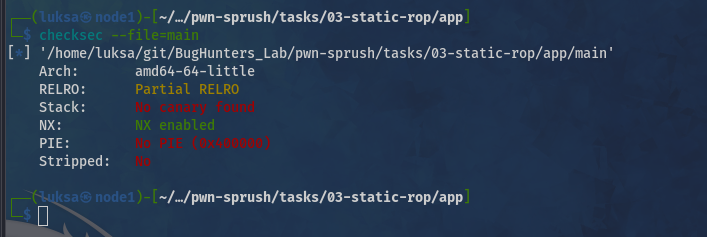
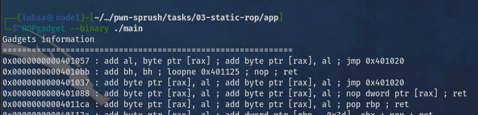
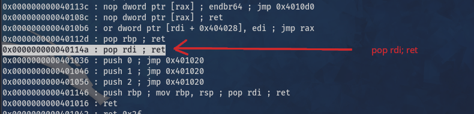
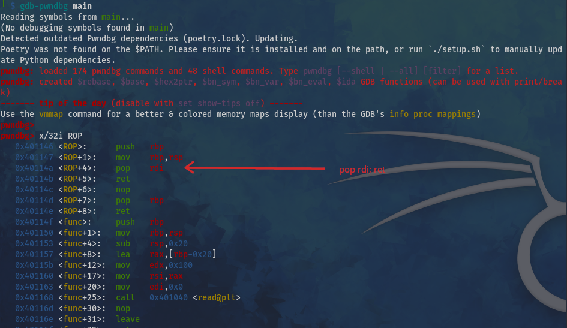
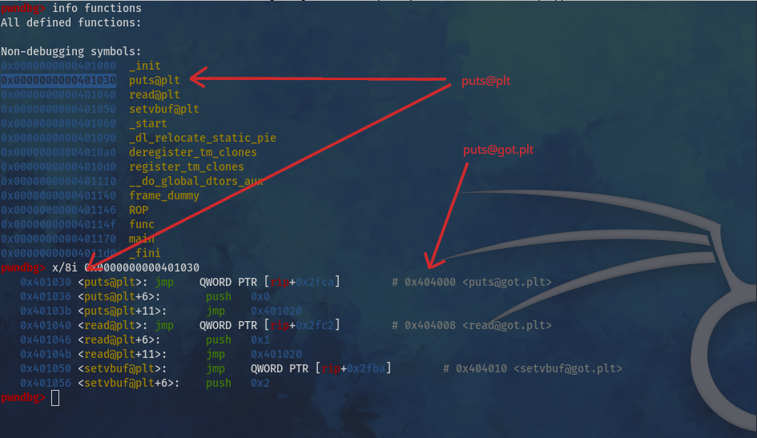

# WRITEUP.md

### Description

Простая таска на использование техники с `ROP` гаджетам цепачками.

### Solition


#### Step 1 - Проверка средс безопасности - checksec

Смотрим какие средства безопасности были использованы при комплияции бинаря, для этого используется утилита `checksec`:



```bash
$ checksec --file=main
[*] '/home/luksa/git/BugHunters_Lab/pwn-sprush/tasks/03-static-rop/app/main'
    Arch:       amd64-64-little
    RELRO:      Partial RELRO
    Stack:      No canary found
    NX:         NX enabled
    PIE:        No PIE (0x400000)
    Stripped:   No
```

#### Step 2 - Получаем адрес POP RDI

Узнаем адрес `pop rdi; ret`, есть 2 варианта:
- использовать утилиту `ROPgadget`;
- использовать `gdbpwn`;

Первый вариант, используем `ROPgadget`:




```bash
$ ROPgadget --binary ./main

Gadgets information
============================================================
0x0000000000401057 : add al, byte ptr [rax] ; add byte ptr [rax], al ; jmp 0x401020
0x00000000004010bb : add bh, bh ; loopne 0x401125 ; nop ; ret
0x0000000000401037 : add byte ptr [rax], al ; add byte ptr [rax], al ; jmp 0x401020
< ... SKIP ... >

0x00000000004010b6 : or dword ptr [rdi + 0x404028], edi ; jmp rax
0x000000000040112d : pop rbp ; ret
0x000000000040114a : pop rdi ; ret

< ... SKIP ... >

Unique gadgets found: 64
```

Второй вариант, используем `gdbpwn`:



```c
└─$ gdb-pwndbg main
Reading symbols from main...
(No debugging symbols found in main)
pwndbg> 
pwndbg> x/32i ROP
   0x401146 <ROP>:	push   rbp
   0x401147 <ROP+1>:	mov    rbp,rsp
   0x40114a <ROP+4>:	pop    rdi
   0x40114b <ROP+5>:	ret
   0x40114c <ROP+6>:	nop
   0x40114d <ROP+7>:	pop    rbp
   0x40114e <ROP+8>:	ret
   0x40114f <func>:     push   rbp
   0x401150 <func+1>:	mov    rbp,rsp
   0x401153 <func+4>:	sub    rsp,0x20
   0x401157 <func+8>:	lea    rax,[rbp-0x20]
   0x40115b <func+12>:	mov    edx,0x100
   0x401160 <func+17>:	mov    rsi,rax
   0x401163 <func+20>:	mov    edi,0x0
   0x401168 <func+25>:	call   0x401040 <read@plt>

```

Получем адрес `pop_rdi = 0x40114a`


#### Step 3 - Получем адреса puts@plt / puts@got.plt

Требуется получить адреса puts@plt и puts@got.plt, для этого выполняем:
 1. выполняем `info functions`
 2. извлекаем адрес обертки `puts@plt`
 3. извлекаем адрес `puts@got.plt` где должен лежать `libc.so`



```c
pwndbg> info functions 
All defined functions:

Non-debugging symbols:
0x0000000000401000  _init
0x0000000000401030  puts@plt
0x0000000000401040  read@plt
0x0000000000401050  setvbuf@plt
0x0000000000401060  _start
0x0000000000401090  _dl_relocate_static_pie
0x00000000004010a0  deregister_tm_clones
0x00000000004010d0  register_tm_clones
0x0000000000401110  __do_global_dtors_aux
0x0000000000401140  frame_dummy
0x0000000000401146  ROP
0x000000000040114f  func
0x0000000000401170  main
0x00000000004011d0  _fini
pwndbg> x/8i 0x0000000000401030
   0x401030 <puts@plt>:	        jmp    QWORD PTR [rip+0x2fca]   # 0x404000 <puts@got.plt>
   0x401036 <puts@plt+6>:	    push   0x0
   0x40103b <puts@plt+11>:	    jmp    0x401020
   0x401040 <read@plt>:	        jmp    QWORD PTR [rip+0x2fc2]   # 0x404008 <read@got.plt>
   0x401046 <read@plt+6>:	    push   0x1
   0x40104b <read@plt+11>:	    jmp    0x401020
   0x401050 <setvbuf@plt>:	    jmp    QWORD PTR [rip+0x2fba]   # 0x404010 <setvbuf@got.plt>
   0x401056 <setvbuf@plt+6>:    push   0x2

```

Получаем адреса:
 - puts@plt = 0x401030
 - puts@got.plt = 0x404000

#### Step 4 - первая честь эксплойта

В вашем коде используется 64-битный calling convention, где первый аргумент передаётся через регистр RDI. Цепочка ROP должна:

 1. Положить адрес (в данном случае адрес GOT записи для puts) в RDI
 2. Вызвать puts@plt (который выведет значение по этому адресу)
 3. Вернуться в main для второго этапа эксплойта
